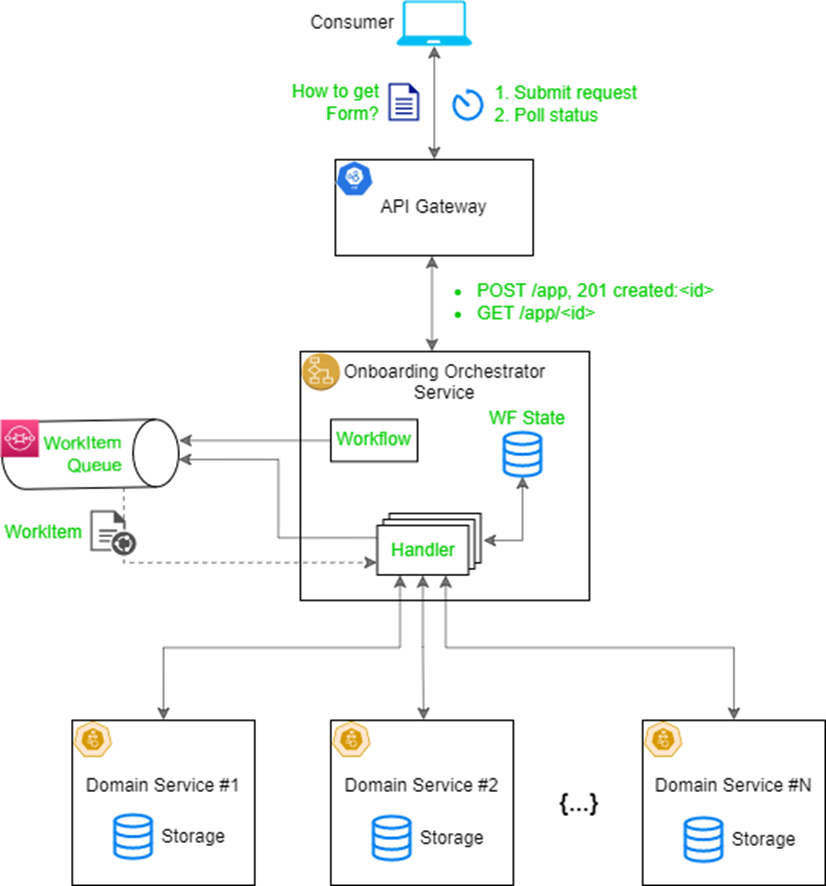
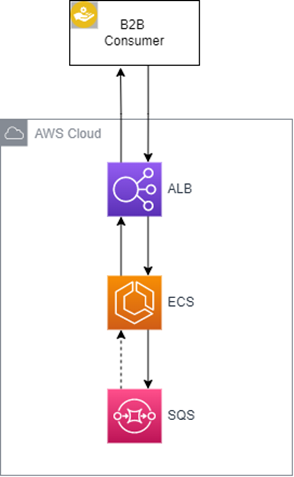

# samplr-java-api-workflow

The sample project for Java Developer Days, 2022, Krakow.
Illustrates opinionated approach on how to use AWS queues for handling workflows.

By default, the SAM template creates one SQS queue. The `template.ecs.yml` has configration 
for running in AWS, but it's not completed.

## How to run locally
It should be ok to run with AWS free tier account with minimal or no costs. 

1. Install [AWS SAM](https://docs.aws.amazon.com/serverless-application-model/latest/developerguide/serverless-sam-cli-install.html)
1. `sam build`
1. `sam deploy --guided`
1. Copy & paste queue url from stack creation outputs to `application.properties`
1. Run java project, the API url is:  http://localhost:8080/applications  
1. Import [postman collection](java-api-workflow.postman_collection.json) and run two requests: with and w/o reply
1. After use undeploy stack: `sam delete`

## Architecture
### Logical view

### Physical View

### Demo how it works

